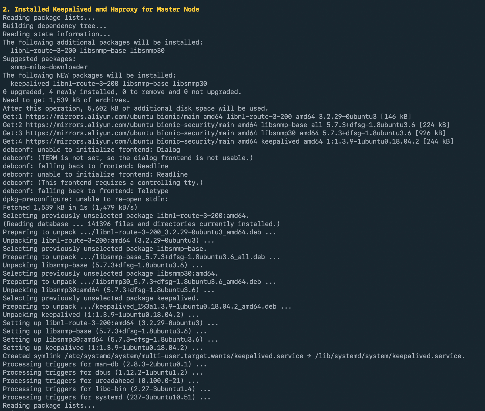
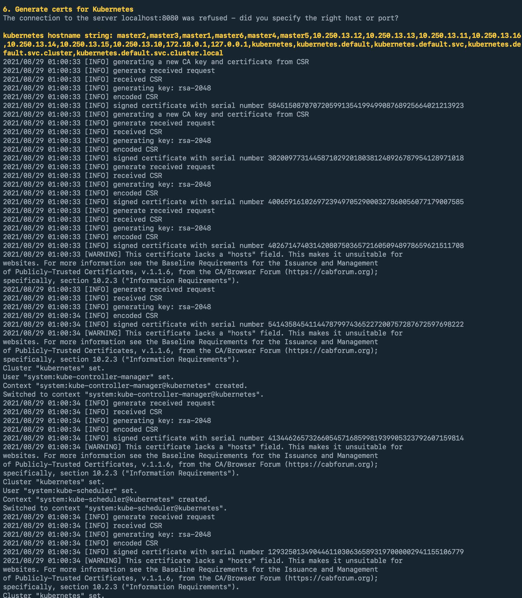
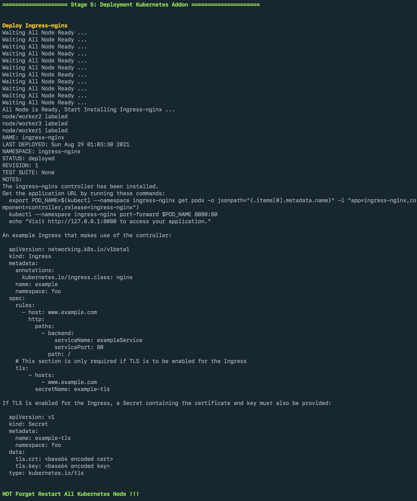

# 1. 介绍

#### 注意事项 

- 默认 3 个 etcd 部署在 3 个 master 节点上。
- 必须以 root 身份运行 setup.sh 脚本。
- 必须在 master 上执行 setup.sh 脚本，任何一个 master 节点都行，不能在 worker 节点上执行。
- 用来部署 k8s 高可用集群的 Linux Server 必须都是同一 Linux 发行版本，要么都是 Debian 系列，要么都是 RHEL 系列。
- 用来部署 k8s 高可用集群的 Linux Server 口令必须相同，把 k8s 节点的 root 口令设置在 `K8S_ROOT_PASS`变量中 

#### Linux 系统支持:

- CentOS 7
- Ubuntu 18
- Ubuntu 20
- (后续支持 Debian 和 CentOS 8 / Rocky Linux)

#### K8S 版本支持

- v1.20.x
- v1.21.x

# 2. 使用

#### 修改 k8s.env 或者 k8s-t1.env 变量文件

```bash
./setup.sh                     		# 使用默认的 k8s.env 变量文件部署 k8s 高可用集群
./setup.sh -a                  		# 使用默认的 k8s.env 变量文件添加 k8s worker 节点
./setup.sh -e k8s-t1.env       		# 使用自定义的 k8s-t1.env 变量文件部署 k8s 高可用集群
./setup.sh -e k8s-t1.env -a    		# 使用自定义的 k8s-t1.env 变量文件添加 k8s worker 节点
./setup.sh -d worker4          		# 删除 k8s worker 节点
```

# 3. 环境变量


#### MASTER 变量

> master 节点的主机名和 IP 地址，格式为```` [Master_Hostname]=Master_IP````，写入 shell dict 中。

#### WORKER 变量

> worker 节点的主机名和 IP 地址，格式为 ````[Worker_Hostname]=Worker_IP````，写入 shell dict 中。

#### EXTRA_MASTER 变量

> 用来扩展 master 节点的（可选），格式为```` [Master_Hostname]=Master_IP````，写入 shell dict 中。

#### ADD_WORKER 变量

> 你要添加的 worker 节点的主机名和 IP地址，格式为  ````[Worker_Hostname]=Worker_IP````，写入 shell dict 中，
>
> 这个变量只会在 ````./setup.sh -a 或者 ./setup.sh -e k8s-t1.env -a ```` 的时候被```` -a ````选项读取。

#### CONTROL_PANEL_ENDPOINT

> k8s 高可用集群，master 节点通过 ````lvs/haproxy/nginx```` 虚拟出来的虚拟IP 地址和端口，例如：````10.250.13.10:8443````。

#### SRV_NETWORK_CIDR

> k8s service network 的网段，例如： ````172.18.0.0/16````。

#### SRV_NETWORK_IP

> kubernetes 集群的 IP 地址，往往都是 service network 中的第一个 IP 地址，例如 ：````172.18.0.1````。

#### SRV_NETWORK_DNS_IP

> kubernetes 集群的 coredns IP 地址，一般是第十个 IP，例如： ````172.18.0.10。````

#### POD_NETWORK_CIDR

> k8s pod network 的网段，例如：````192.168.0.0/16````。

#### K8S_ROOT_PASS

> 服务器 root 用户口令，默认是 ````toor````。

#### K8S_VERSION

> 你要部署的 k8s 版本，支持 ````v1.20```` ````v1.21````，默认是最新版本。

#### K8S_PROXY_MODE

> ````kube-proxy```` 使用的 ````proxy mode````，支持 ````iptables````  ````ipvs````，默认是 ````ipvs````。

#### INSTALL_XXX

> 是否需要安装指定的插件，不安装变量留空，安装设置变量任何值。


# 4. k8s 部署过程截图











