## 1. 介绍

#### 推荐 Kubernetes 课程

这个项目从杜宽老师的 Kubernetes 视频课程中借鉴了很多，如果有想学 Kubernetes 但无从下手的小伙伴，可以看下杜宽老师的 [Kubernetes 视频课程](https://edu.51cto.com/center/course/lesson/index?id=592685)

#### 注意事项 

- 默认 3 个 etcd 部署在 3 个 master 节点上。
- 必须以 root 身份运行 setup.sh 脚本。
- 必须在 master 上执行 setup.sh 脚本，任何一个 master 节点都行，不能在 worker 节点上执行。
- 用来部署 k8s 高可用集群的 Linux Server 必须都是同一 Linux 发行版本，要么都是 Debian 系列，要么都是 RHEL 系列。
- 用来部署 k8s 高可用集群的 Linux Server 口令必须相同，把 k8s 节点的 root 口令设置在 `K8S_ROOT_PASS`变量中 
- 6个 stage 功能介绍：
    - Stage Prepare: 准备阶段，用来配置 ssh 免密码登录和主机名
    - Stage 1: Linux 系统准备
    - Stage 2: 为部署 Kubernetes 做好环境准备
    - Stage 3: 安装 Docker/Containerd
    - Stage 4: 部署 Kubernetes Cluster
    - Stage 5: 部署 Kubernetes 必要组件和插件


#### Linux 系统支持：

- Debian 11
- Ubuntu 20、Ubuntu 18
- Rocky 8
- CentOS 7
- 最推荐的是 Debian、最不推荐的是 CentOS7
- (可能还会支持 Debian 10，不一定)

#### Kubernetes 版本支持：

- v1.23+
- v1.22+
- v1.21+
- v1.20+

#### 计划做的事

- 更加简化安装
- stage prepare，stage 1-3 是可以重复运行的。stage 4 加强验证，做到可以多次运行 stage 4
- 完善 stage 5 的部署，同时 stage 5 中的一些 addon 有些已经很老了，需要更新到新版本（已更新 ingress-nginx）
- 部署 kubernetes cluster 目前一共有5个 stage，打算再加一个 stage 6
- stage 6 功能，这些功能都可以通过设置环境变量来选择。
    - 自动备份 etcd 和 kubernetes 数据和配置文件
    - 配置防火墙
    - Linux 系统安全加固

## 2. 使用

##### 修改 k8s.env 或者 k8s-u20.env 变量文件

```bash
./setup.sh                     		# 使用默认的 k8s.env 变量文件部署 k8s 高可用集群
./setup.sh -a                  		# 使用默认的 k8s.env 变量文件添加 k8s worker 节点
./setup.sh -e k8s-u20.env       	# 使用自定义的 k8s-u20.env 变量文件部署 k8s 高可用集群
./setup.sh -e k8s-u20.env -a    	# 使用自定义的 k8s-u20.env 变量文件添加 k8s worker 节点
./setup.sh -d worker4          		# 删除 k8s worker 节点
```

## 3. 环境变量

| 环境变量名             | 变量解释                                                     |
| ---------------------- | ------------------------------------------------------------ |
| MASTER                 | master 节点的主机名和 IP 地址，格式为`[Master_Hostname]=Master_IP`，写入 shell dict 中。 |
| WORKER                 | worker 节点的主机名和 IP 地址，格式为 `[Worker_Hostname]=Worker_IP`，写入 shell dict 中。 |
| EXTRA_MASTER           | 用来扩展 master 节点的（可选），格式为` [Master_Hostname]=Master_IP`，写入 shell dict 中。 |
| ADD_WORKER             | 你要添加的 worker 节点的主机名和 IP地址，格式为  `[Worker_Hostname]=Worker_IP`，写入 shell dict 中。这个变量只会在 `./setup.sh -a` 或者 `./setup.sh -e k8s-u20.env -a`  的时候被 `-a `选项读取。 |
| CONTROL_PANEL_ENDPOINT | k8s 高可用集群，master 节点通过 `lvs/haproxy/nginx` 虚拟出来的虚拟IP 地址和端口，例如：`10.250.13.10:8443`。 |
| SRV_NETWORK_CIDR       | k8s service network 的网段，例如： `172.18.0.0/16`。         |
| SRV_NETWORK_IP         | kubernetes 集群的 IP 地址，一般都是 service network 中的第一个 IP 地址，例如 ：`172.18.0.1`。 |
| SRV_NETWORK_DNS_IP     | kubernetes 集群的 coredns IP 地址，一般是第十个 IP，例如： `172.18.0.10。` |
| POD_NETWORK_CIDR       | k8s pod network 的网段，例如：`192.168.0.0/16`。             |
| K8S_ROOT_PASS          | root 用户口令，默认是 `toor`。                               |
| K8S_VERSION            | 你要部署的 k8s 版本，支持 `v1.23` `v1.22` `v1.21` `v1.20`，默认是最新版本。 |
| K8S_PROXY_MODE         | `kube-proxy` 使用的 proxy mode，支持 `iptables`  `ipvs`，默认是 `ipvs`。 |
| INSTALL_XXX            | 是否需要安装指定的插件，不安装变量留空，安装设置任意变量值。 |


## 4. k8s 部署过程截图

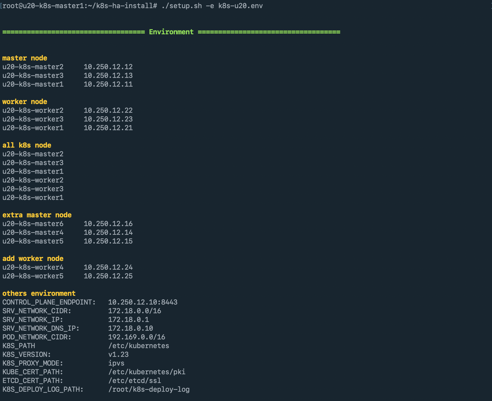

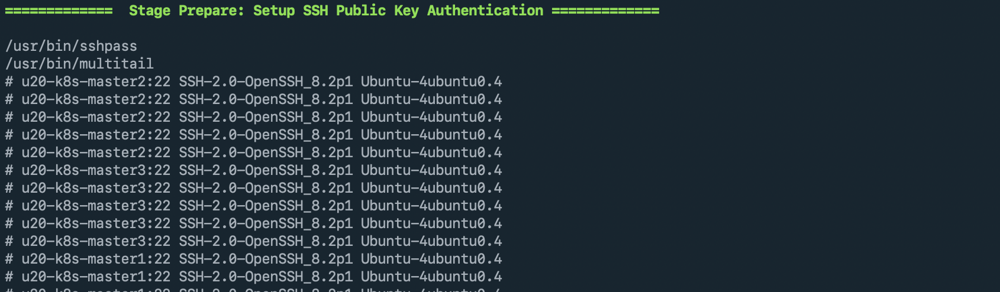


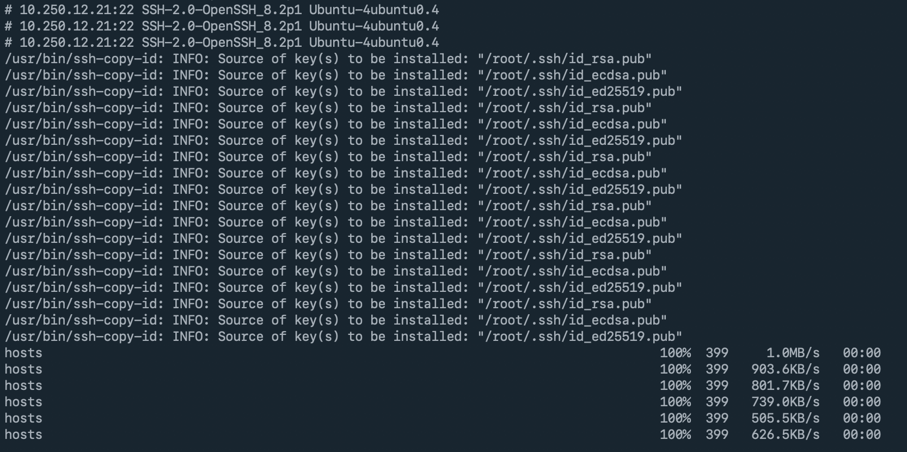

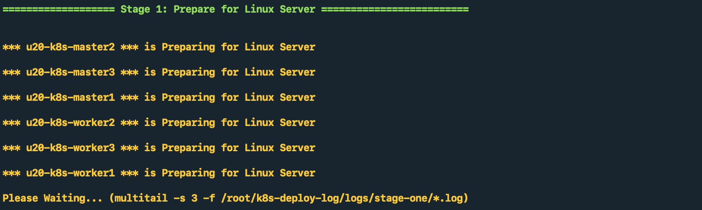

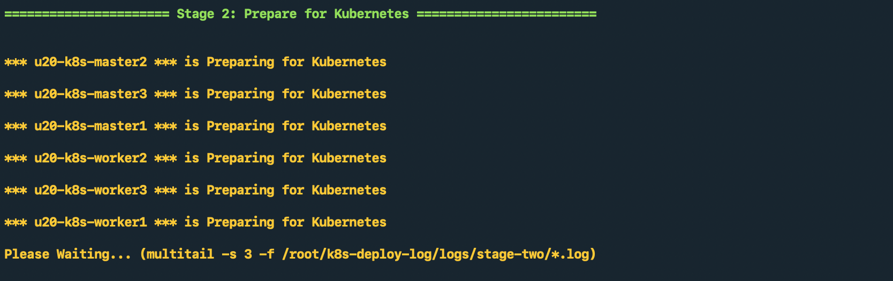


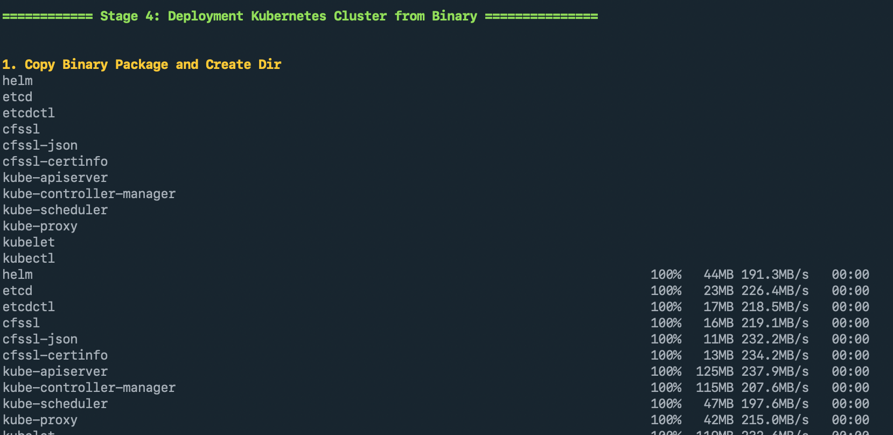

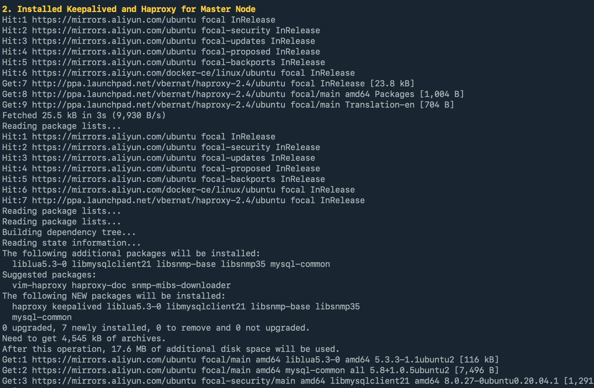

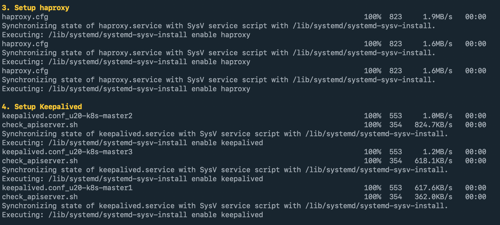

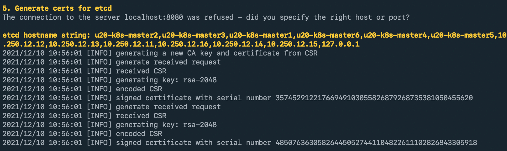

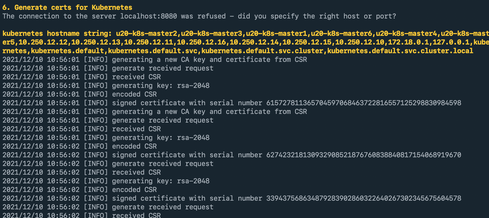

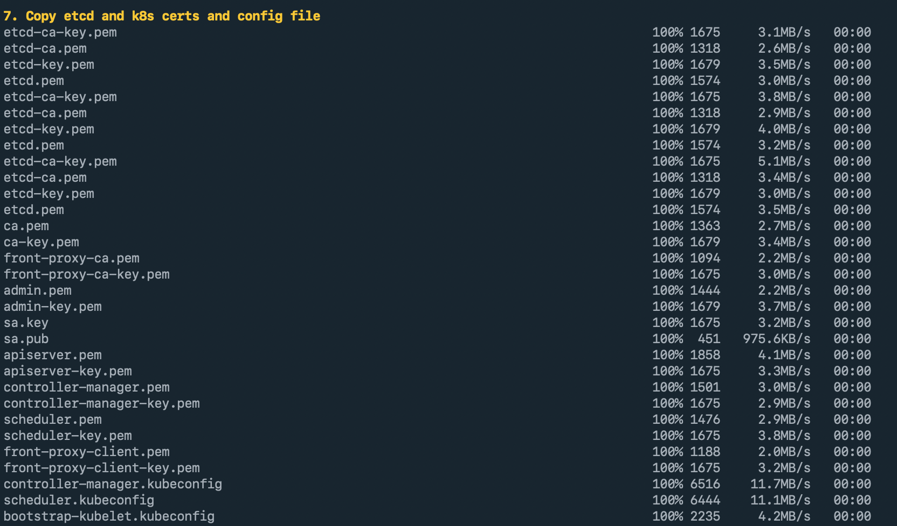

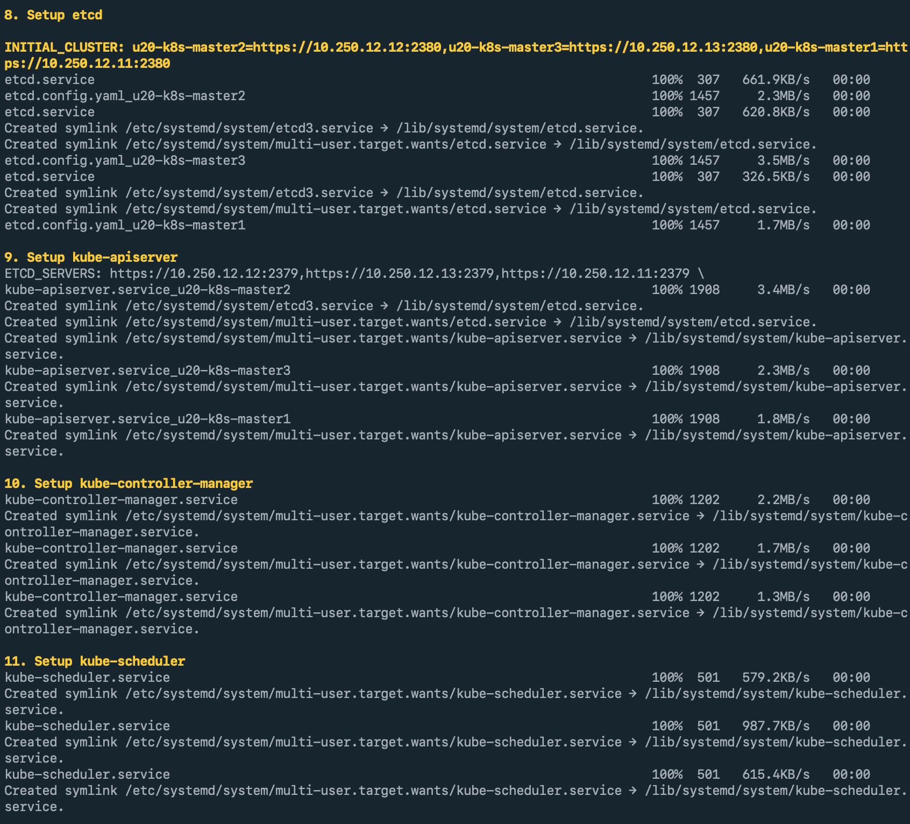

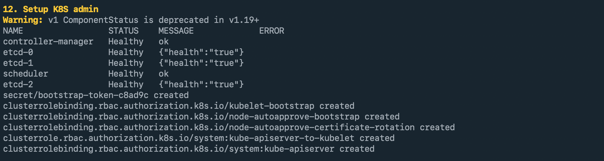

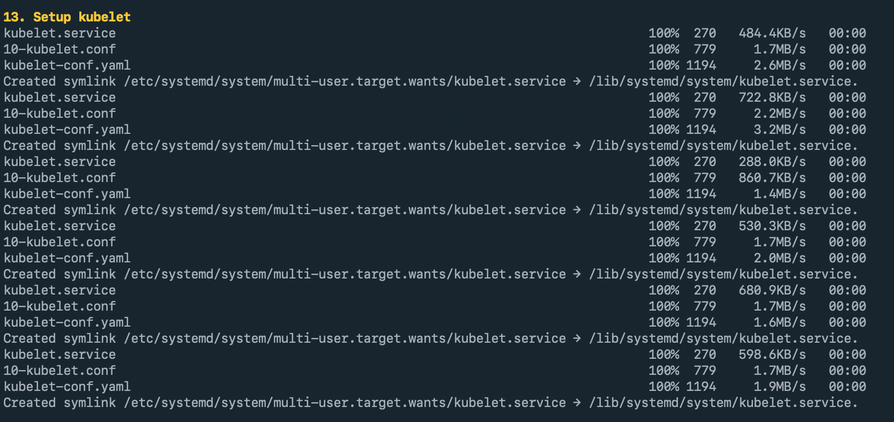

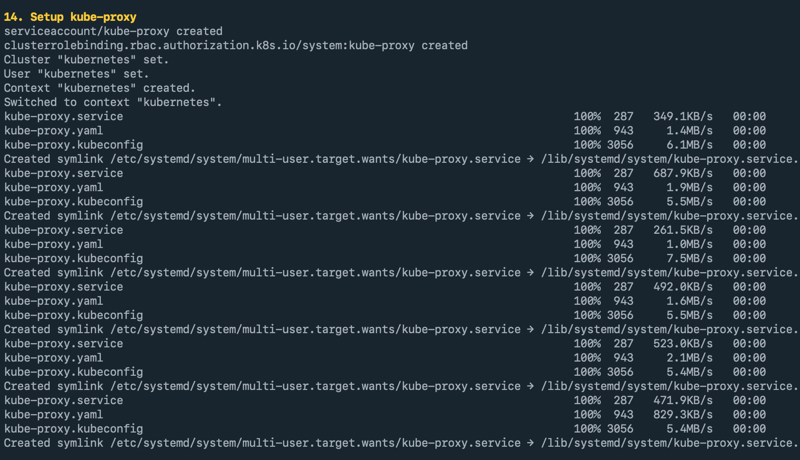

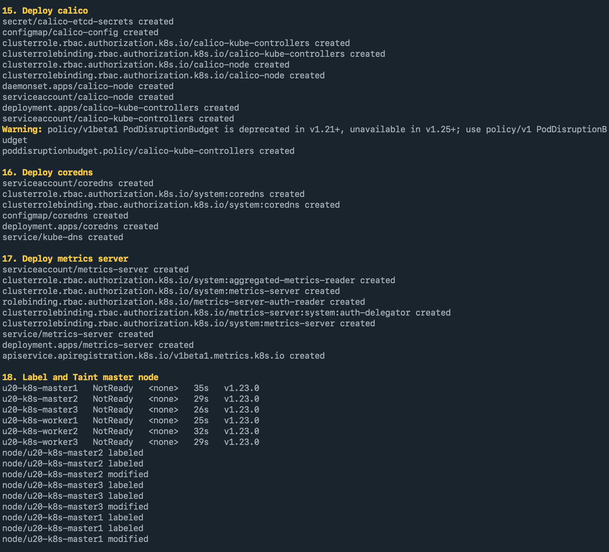

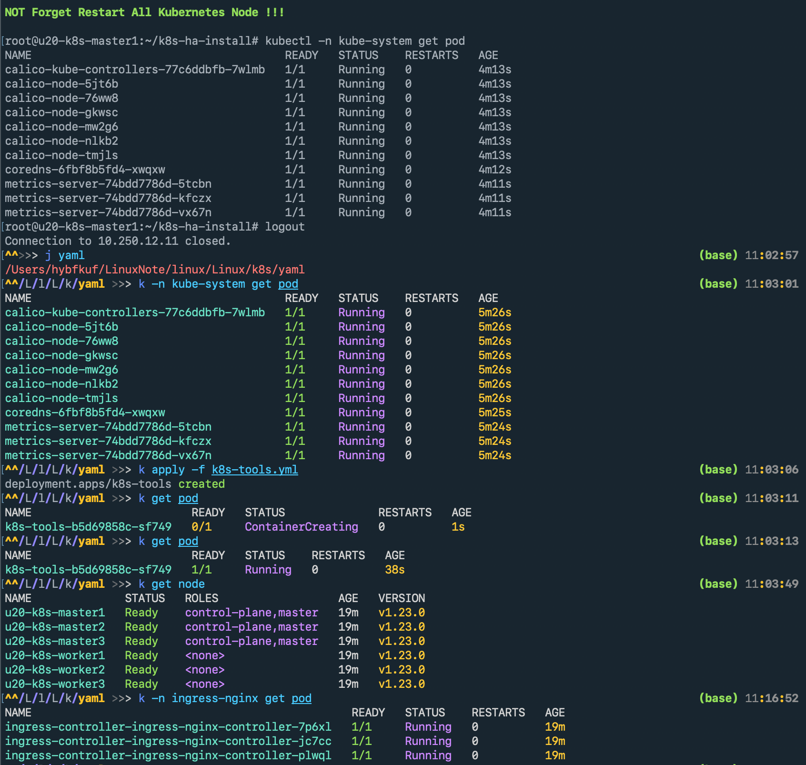

## License

This software is licensed under the [Apache 2.0](https://github.com/forbearing/k8s-ha-install/blob/master/LICENSE) © [hybfkuf](https://github.com/forbearing/).
